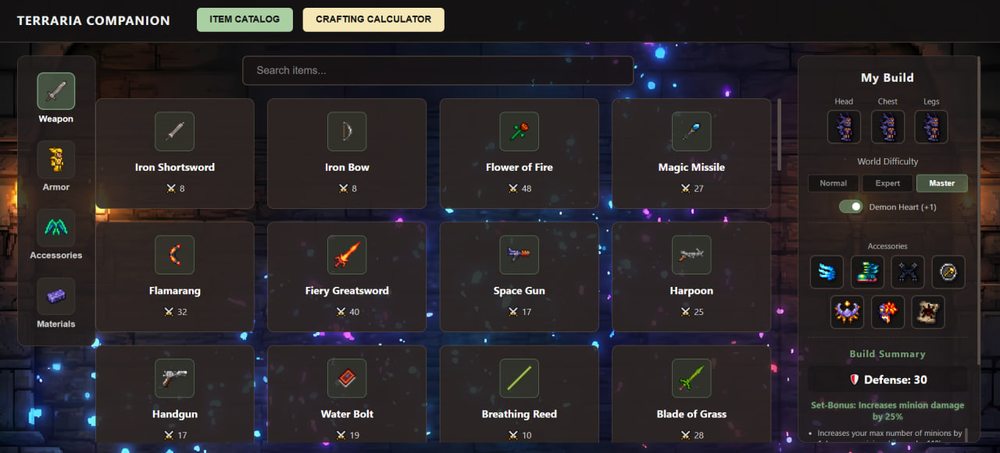
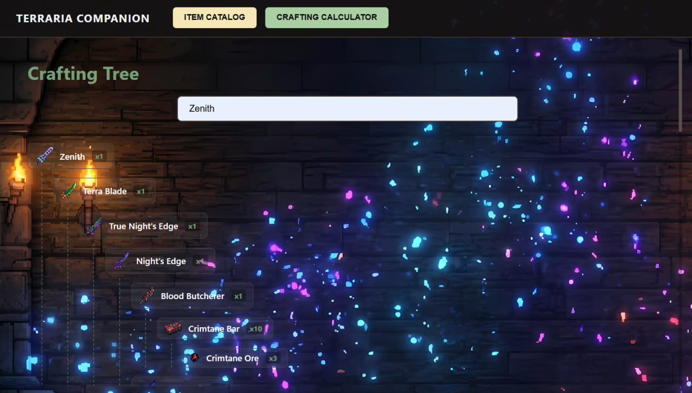
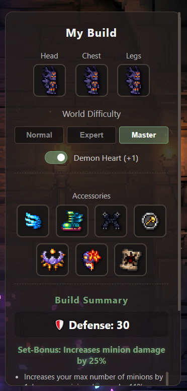

# 🌳 Terraria Companion Web App


A full-stack, Single Page Application (SPA) designed to serve as an ultimate companion tool for Terraria players. It features a comprehensive item catalog, a recursive crafting calculator, and an interactive drag-and-drop build planner.

---

## 📸 Preview


| Item Catalog | Crafting Tree | Build Planner |
| :---: | :---: | :---: |
|  <br> *Dynamic filtering and search* |  <br> *Recursive recipe calculation* |  <br> *Drag-and-Drop equipment slots* |

---

## ✨ Key Features

* **Interactive Item Catalog:** Browse thousands of items, armor sets, accessories, and materials. Includes live text search and category filtering.
* **Dynamic Wiki Modals:** Clicking on any item or NPC opens an overlay modal with detailed statistics (damage, defense, rarity, knockback, tooltips) fetched dynamically from the database.
* **Recursive Crafting Calculator:** Select an item to instantly generate a visual, multi-level Crafting Tree. The backend recursively calculates all base materials required, successfully handling cyclic dependencies.
* **Drag-and-Drop Build Planner:** An interactive workspace where users can drag items from the catalog into specific equipment slots (Head, Torso, Legs, Accessories). 
* **Dynamic Difficulty Scaling:** Toggle between Normal, Expert, and Master modes to automatically adjust the number of available accessory slots (including Demon Heart integration).
* **Automatic Stat Calculation:** The planner calculates total defense and active buffs in real-time, including hidden Set Bonuses for matching armor pieces.

---

## 🛠️ Technology Stack

### Frontend (Client-Side)
* **Architecture:** Single Page Application (SPA)
* **Core:** Vanilla JavaScript (ES6+), HTML5, CSS3
* **Features:** DOM Manipulation, Drag-and-Drop API, Fetch API, LocalStorage for state persistence.

### Backend (Server-Side)
* **Environment:** Node.js
* **Framework:** Express.js
* **Architecture:** MVC (Model-View-Controller)
* **Database:** MongoDB (Atlas Cloud)
* **ODM:** Mongoose (using schema-less approach `{ strict: false }` for polymorphic item data)

---

# 🚀 Installation & Setup

To run this project locally, follow these steps:

## 1. Clone the Repository

```bash
git clone https://github.com/MaXDmitR/terraria-companion.git
cd terraria-companion
```

## 2. Install Dependencies

Navigate to the server directory and install the required npm packages:

```bash
cd server
npm install
```

## 3. Environment Variables

Create a `.env` file in the `server` directory and add your MongoDB connection string:

```env
MONGO_URI=mongodb+srv://<username>:<password>@cluster...
```

## 4. Run the Application

Start the backend server:

```bash
npm start
```

The server will run on:

```text
http://localhost:3000
```

Open `index.html` in your browser (or use a Live Server extension) to access the frontend application.

---

# 🧠 System Architecture

The application is built on a **decoupled Client–Server architecture**.

The backend exposes a **RESTful API** designed with modular controllers (`itemController`, `craftingController`, `buildController`) to handle specific business logic.

Instead of heavy relational tables, the database utilizes **MongoDB's document-oriented structure**, which perfectly suits the highly polymorphic nature of Terraria's in-game items.

The frontend consumes these JSON endpoints and handles all view rendering dynamically without page reloads.

---

# 📜 License

This project is created for educational and portfolio purposes.

All game assets, sprites, names, and related intellectual property belong to **Re-Logic** and **Terraria**.
